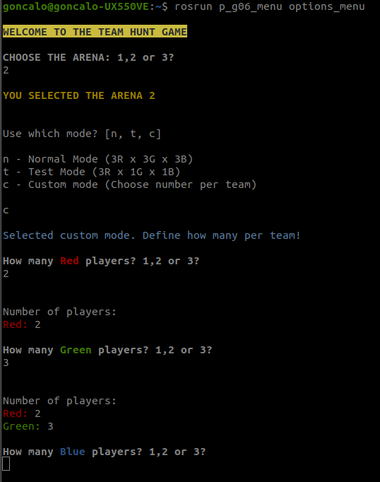

# PSR_TP3_G6
Teams:

Gameplay images:

Videos:

####################################################################

**Team Hunt - Blue1 gmapping arena 3**

Use the blue1 to map the arena 3 using gmapping node and camera_and_lidar.py script to move the robot, avoiding the obstacles.

Launch arena 3:

    roslaunch p_g06_bringup th_arenas.launch arena:=3

Launch player blue1:  

    roslaunch p_g06_bringup bringup.launch 

Launch gmapping:

    roslaunch p_g06_bringup gmapping.launch

Launch rviz

    roslaunch p_g06_bringup visualize.launch 

Launch the script on one robot (blue1)  

    roslaunch p_g06_camera_and_lidar one_robot_camera_lidar.launch 

####################################################################

**Team Hunt - Camera and Lidar on 1 robot (demonstration)**

Use camera_and_lidar.py script running on one robot for the purpose of demonstration.

Launch arena 3:

    roslaunch p_g06_bringup th_arenas.launch arena:=3

Launch 3 robots of each color (blue, red and green): 

    roslaunch p_g06_multi_robot multi_robot.launch

Launch the script on one robot (blue1)  

    roslaunch p_g06_camera_and_lidar one_robot_camera_lidar.launch  

####################################################################

**Team Hunt Game - camera and lidar script for all robots**

Use camera_and_lidar.py running on all teams.

Launch arena 3:

    roslaunch p_g06_bringup th_arenas.launch arena:=3

Launch 3 robots of each color (blue, red and green): 

    roslaunch p_g06_multi_robot multi_robot.launch

Launch the script for 3 robots of each team

    roslaunch p_g06_camera_and_lidar multi_robot_camera_lidar.launch 

####################################################################

**Team Hunt - Oriented goal on one robot (demonstration)**

Use oriented_goal_cmd_vel.py script running on one robot for the purpose of demonstration.

Launch arena 1:

    roslaunch p_g06_bringup th_arenas.launch arena:=1

Launch 3 robots of each color (blue, red and green): 

    roslaunch p_g06_multi_robot multi_robot.launch

Launch the script for 1 robot:

    roslaunch oriented_goal one_robot_cmd_vel.launch

")

####################################################################

**Team Hunt - Oriented Goal Multi Robot**

Use oriented_goal_cmd_vel.py script running on all teams.

Launch arena 1:

    roslaunch p_g06_bringup th_arenas.launch arena:=1

Launch 3 robots of each color (blue, red and green): 

    roslaunch p_g06_multi_robot multi_robot.launch

Launch for all robots: 

    roslaunch oriented_goal multi_robot_cmd_vel.launch 

####################################################################

**Team Hunt - Nav3D goal on robot (demonstration)**

Use driver_nav3d, obstacle_finder e player_finder scriptd running on one robot.

Launch arena 1:

    roslaunch p_g06_bringup th_arenas.launch arena:=1

Launch 3 robots of each color (blue, red and green): 

    roslaunch p_g06_multi_robot multi_robot.launch

Launch for red1 robot: 

    roslaunch scrits_bringup nav3d.launch player_name:=red1 visualize:=True 

")

####################################################################

**Team Hunt - Nav3D Goal Multi robot**

Use driver_nav3d, obstacle_finder e player_finder scriptd running on one robot.

Launch arena 1:

    roslaunch p_g06_bringup th_arenas.launch arena:=1

Launch 3 robots of each color (blue, red and green): 

    roslaunch p_g06_multi_robot multi_robot.launch

Launch for all robots: 

    roslaunch p_g06_bringup multi_nav3d.launch 

####################################################################

**Team Hunt - Green - camera and lidar; Blue - Nav3d; Red - Oriented Goal**

Each team uses a different method to perceive the environment and the other players:

- Green Team: camera and lidar script;
- Red Team: Oriented Goal;
- Blue Team: Nav3D; 

Launch arena 1:

    roslaunch p_g06_bringup th_arenas.launch arena:=1

Launch 3 robots of each color (blue, red and green): 

    roslaunch p_g06_multi_robot multi_robot.launch

Launch the referee of the game: 

    rosrun th_referee th_referee

Launch for all robots: 

    roslaunch scrits_bringup multi_robot_multi_script.launch 

####################################################################

**Blue robot - Oriented Goal with AMCL, Map Server and Move Base**

Use oriented_goal.py script with AMCL, Map Server and Move Base running on one robot. This idea was abandoned because AMCL didn't work properly when the robot was repositioned.

Launch arena 3:

    roslaunch p_g06_bringup th_arenas.launch arena:=3

Launch 3 robots of each color (blue, red and green): 

    roslaunch p_g06_multi_robot multi_robot.launch

Launch navigation node (AMCL, Map Server and Move Base):

    roslaunch p_g06_navigation p_g06_navigation.launch

Launch script

    roslaunch oriented_goal one_robot.launch  

####################################################################

**FNR track - manual drive with keyboard**

Use manual_drive.py (an adaptation of turtlebot_teleop) to control the robot on the FNR track using the keyboard.

Launch world:

    roslaunch p_g06_bringup fnr_course.launch  

Launch robot on start position for teleop:

    roslaunch p_g06_bringup fnr_bringup.launch

Launch camera view:

    rosrun image_view image_view image:=/blue1/camera/rgb/image_raw

Launch teleop:

    rosrun p_g06_drivers manual_drive.py 

####################################################################

**FNR track - Autonomous driving**

Use fnr_auto_drive.py to drive the robot by itself on fnr track.

Launch fnr without obstacles:

    roslaunch p_g06_bringup fnr_no_obs.launch  

Launch robot on start position for follow line:

    roslaunch p_g06_bringup fnr_no_obs_bringup.launch 

Launch "autonomous driving":

    rosrun p_g06_fnr_course fnr_auto_drive.py 

####################################################################

**Options Menu - Game options interface**

Python script to select game parameters. Great for tests because it brings up the game in a very quick, simple and intuitive way.

Launch options_menu:

    rosrun p_g06_menu options_menu
  

####################################################################

**Notas reunião alinhamento dia 30-1-2022**

Partes:

1- O básico das aulas

2- Tratamento de imagem

3- Navegação

4- Extras

Possíveis Extras:

. Evitar colisões com parede

. Código decisão para diferenciar perfil de robot. Exemplo: um com mentalidade atacante, um defensivo, um equilibrado. . Ideia: testar combinações de perfis!

. Comunicar entre equipa quando um não está a ver

. Sequência de pŕemios individuais no fim!

. Escolher número jogadores

. Adicionar Menu de início com start, game options

. Guardar recordes. Ex: criar um json.
